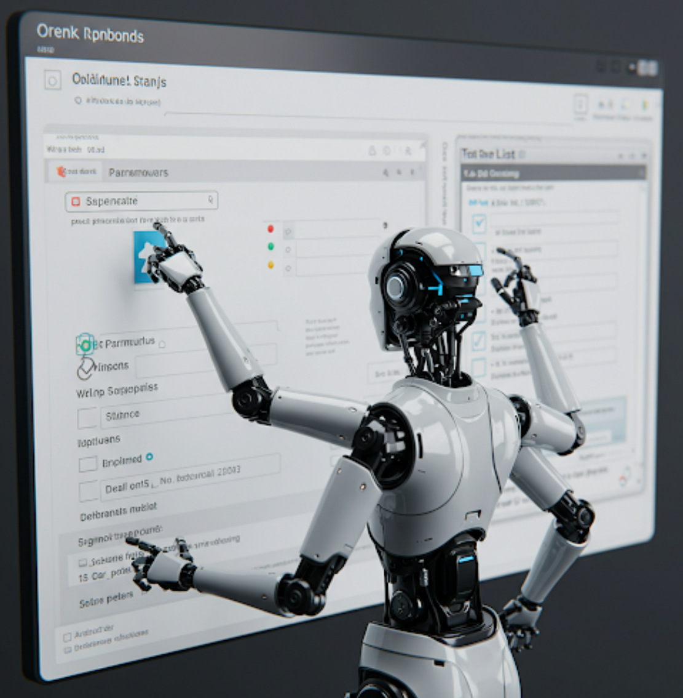

# BAW Virtual Users Tool

**[WORK IN PROGRESS...]**



Last update: 2025-03-13

## Brief introduction
It is a tool written in Python language for simulating interactions between users and tasks of applications deployed in IBM Business Automation Workflow (both Traditional and CP4BA deployments).

It is based on the open source tool Locust (https://locust.io)

The tool is designed to interact only with human tasks through the REST APIs made available by IBM BAW. The features allow you to request the list of tasks for a specific user, to claim a task, to release a previously claimed task to the team, to update the data of a task without completing it, to complete a task.

The tool also allows you to create new process instances with an optional startup payload.

It is possible to define a set of virtual users for each role defined in the process (TeamBindings). A virtual user can be associated with multiple roles. Each virtual user can be configured with its own access password.

The tool can interact with IBM BAW deployed in Traditional (WAS), Containerized (CP4BA), Federated (CP4BA, mix of BAW and WFPS) mode.

It can be used as a load generator for partial tests of applications and the underlying infrastructure. By partial test we mean that for example the workload normally generated for CSHS and Ajax calls is not activated because the tasks are only interacted with REST API calls, consequently the server is stressed less than in reality.

Furthermore, applications that use IME cannot be completed autonomously by the tool.

The tool is accompanied by an example application and a set of configurations that can be used as an example.

The tool can be used from the command line or as a containerized image. In case of a containerized image the configuration files must be previously inserted into a config map.

This tool is open source
```
https://opensource.org/license/mit/
MIT License

Author: Antonioni Marco

Permission is hereby granted, free of charge, to any person obtaining a copy of this software and associated documentation files (the “Software”), to deal in the Software without restriction, including without limitation the rights to use, copy, modify, merge, publish, distribute, sublicense, and/or sell copies of the Software, and to permit persons to whom the Software is furnished to do so, subject to the following conditions:

The above copyright notice and this permission notice shall be included in all copies or substantial portions of the Software.

THE SOFTWARE IS PROVIDED “AS IS”, WITHOUT WARRANTY OF ANY KIND, EXPRESS OR IMPLIED, INCLUDING BUT NOT LIMITED TO THE WARRANTIES OF MERCHANTABILITY, FITNESS FOR A PARTICULAR PURPOSE AND NONINFRINGEMENT. IN NO EVENT SHALL THE AUTHORS OR COPYRIGHT HOLDERS BE LIABLE FOR ANY CLAIM, DAMAGES OR OTHER LIABILITY, WHETHER IN AN ACTION OF CONTRACT, TORT OR OTHERWISE, ARISING FROM, OUT OF OR IN CONNECTION WITH THE SOFTWARE OR THE USE OR OTHER DEALINGS IN THE SOFTWARE.
```

<br>
<i>For an introduction to the benefits of end-to-end test automation for business processes see the link</i> https://github.com/marcoantonioni/BAWVirtualUsersTool
</br>

The source code of BAWVirtualUsersTool has been documented using by **IBM watsonx Code Assistant** 

## How to evaluate this tool
- the tool is open source, released using MIT licenses (https://opensource.org/license/mit/)
- the tool is non-invasive, requires no installation of any kind on BAW servers, performs all its functions by simulating the end user from the outside and the system administrator for virtual users configurations
- the tool is based on Python v3 technology available on every operating system among the most commonly used ones
- the tool is also offered in Docker image format to simplify the client side setup operations
- has been designed and created to better support IBM customers and IBM partners who cannot use other tools for various reasons
- in the git repository there are demo applications and related pre-configurations that can be used to evaluate the tool with your minimum effort
- demo applications are available for both traditional IBM Business Automation Workflow environment (based on WAS-ND) and containerized environment (CP4BA)
- in addition to the main tool for executing the test/load, there are a series of support functions to simplify all setup and environment cleaning activities
- for the CP4BA containerized scenario there are simplification tools for LDAP deployment dedicated to virtual users and relative automatic IDP configuration
- the tool does not offer any mocking solutions for any services integrated by the processes being tested

## Tool description

- [TBD] description of demo applications and their run configurations (test/load)

- [TBD] how to configure and implement a test/load scenario

  a) custom payload modules and assert managers
  
  b) configuration of virtual users
  
  c) assignment of virtual users to task subjects

- [TBD] configuration needed for test scenarios

  a) traditional scenario
  
  b) containerized scenario

- [TBD] run examples with docker image

- Limitations in this version

  a) the tool does not manage the start of optional Activities

## Companion repositories

This repository is accompanied by two other repos that contain the BAW applications (virtual-users-locust-apps) and the configurations used for the run tests (virtual-users-locust-test-configs).
Clone all 3 repositories to have the following structure on the file system:
<pre>
.
├── virtual-users-locust-sandbox
├── virtual-users-locust-apps
└── virtual-users-locust-test-configs
</pre>

## Main modules descriptions

[BAWVUT Main modules descriptions](./docs/BAWVUT-Modules-descriptions.md)

## Program structure

Description of most important python files.

### file: BAWVirtualUsersTool.py
The main module is <b>BAWVirtualUsersTool.py</b>, it is referenced by the '.conf' file used as the value of the '--config' parameter of the 'locust' program
```
locust --config=your-config-file
```
The module defines a series of methods for event management and a class <b>IBMBusinessAutomationWorkflowUser</b> that defines the data and operations of each single virtual user.

The initialization event management method runs the setup of a dynamic python module that is referenced by the variable <b>bpmDynamicModule</b>. The dynamic module implements the manager of the various payloads that are generated during the run for each task (update/completion) and for the creation of new process instances.
The python source file specific to the run is referenced by the variable <b>BAW_PAYLOAD_MANAGER</b> in '.properties' file in turn identified by the variable <b>BAW_ENV</b> in '.conf' file.

The 'unitTestInstancesExporter' method runs the export of the data of the processes that have been started for a run configured as a unit test. The data is inserted into a file in SQLite format and can be consulted with simple SQL queries.

### file: bawTasks.py
The module defines two classes, <b>SequenceOfBpmTasks(SequentialTaskSet)</b> and <b>UnitTestScenario(SequenceOfBpmTasks)</b>

The <b>SequenceOfBpmTasks</b> class extends SequentialTaskSet [from locust] and defines variables and methods for managing basic human task functionalities.

The <b>UnitTestScenario</b> class extends SequenceOfBpmTasks and defines the <b>bawCreateScenarioInstances</b> method for creating and cataloging process instances that will be the object of unit tests. The cataloged process instances will then be exported to the SQLite database at the end of the run.

The methods defined by the <b>SequenceOfBpmTasks<b> class allow you to perform the functions of reading the available tasks (task list), reading and updating the data of a human task, executing the claim, releasing, completing a human task. Log in and create a new process instance.

The methods that generate a task data update and that start a new process instance make dynamic use of the payload manager defined by <b>bpmDynamicModule</b>.

## Configuration files

[BAWVUT-Configuration](./docs/BAWVUT-Configuration.md)

## Docker image

[BAWVUT-Docker](./docs/BAWVUT-Docker.md)

## Development environment setup and configuration (Linux env)

Install Python modules 
```
pip install locust
pip install jproperties
pip install warlock
pip install jsonpath-ng

# optional
pip install sqlite-utils

# update to latest version
pip3 install -U --pre locust
```

## Run examples

In a **LOAD_TEST** scenario, the number of process instances started when CREATEPROCESS is present in BAW_VU_ACTIONS is variable and depends on the number of users registered in the Team defined as "starter" and on the actions that each of these users can perform sequentially depending on the values ​​set in BAW_VU_ACTIONS .

In a **UNIT_TEST** scenario the number of completed process instances depends on the maximum duration limit defined by BAW_UNIT_TEST_MAX_DURATION.

In both scenarios, the max number of process instances started is defined by the BAW_PROCESS_INSTANCES_MAX variable.

*!!! ===>> Before run any scenario update configuration files for your runtime environment.*

### Run Unit Test or Load Test
The run type is defined by BAW_RUN_MODE variable
```
locust --config=../virtual-users-locust-test-configs/configurations/baw-cp4ba/baw-vu-cfg-1.conf
```

### Create process instances
Example for 10 instances
```
python ./createProcessInstance.py -e ../virtual-users-locust-test-configs/configurations/baw-cp4ba/env1.properties -i 10
```

### List process instances
Select process instances using filters for state (-s) and time range from-date (-f) / to-date (-t) 
```
python ./listProcessInstances.py -e ../virtual-users-locust-test-configs/configurations/baw-cp4ba/env1.properties -s Active,Terminated,Completed,Failed -f 2025-03-01T00:00:00Z -t 2025-03-31T00:00:00Z
```

### Export process instance data
Export process instances of specific process template (-n) using filters for state (-s) and time range from-date (-f) / to-date (-t) 

Export to standard output
```
python ./exportProcessInstancesData.py -e ../virtual-users-locust-test-configs/configurations/baw-cp4ba/env1.properties  -s Active,Terminated,Completed,Failed -f 2025-03-01T00:00:00Z -t 2025-03-31T00:00:00Z -n VUSClaimCompleteTwoRoles
```

Export to file
```
python ./exportProcessInstancesData.py -e ../virtual-users-locust-test-configs/configurations/baw-cp4ba/env1.properties  -s Active,Terminated,Completed,Failed -f 2025-03-01T00:00:00Z -t 2025-03-31T00:00:00Z -n VUSClaimCompleteTwoRoles -o ../virtual-users-locust-test-configs/outputdata/VUSClaimCompleteTwoRoles-instances.json
```

### Terminate instances
Terminate all running instances for process templates defined in configuration file.
```
python ./terminateProcessBulk.py -e ../virtual-users-locust-test-configs/configurations/baw-cp4ba/env1.properties
```

### Delete instances
Terminate all running instances if -t set to true then delete all terminated process instances for process templates defined in configuration file.
```
python ./deleteProcessBulk.py -e ../virtual-users-locust-test-configs/configurations/baw-cp4ba/env1.properties -t true
```

### Data model and code template generation
This command exports the data model and creates python files that can be used to generate payloads for the various human tasks of the process.
The generated files are:
<pre>
payloadManager-<i>'process name-acronym-version'</i>.py
payloadManager-<i>'process name-acronym-version'</i>-Datamodel'.py
payloadManager-<i>'process name-acronym-version'</i>-JsonSchema.py
assertManager-<i>'process name-acronym-version'</i>s.py
</pre>
For more details see [BAWVUT-DataModelAndCodeTemplate](./docs/BAWVUT-DataModelAndCodeTemplate.md)

*!!! ===>> Before run a generation make a backup of your previous generated files.*
```
python ./generateCodeFromTemplates.py -e ../virtual-users-locust-test-configs/configurations/baw-cp4ba/env1.properties -o ../virtual-users-locust-test-configs/configurations/managers
```

### Generate users, groups in LDIF files and user credentials in CSV files
This command generate an *.ldif* file and a *.csv* file.
The *.ldif* file contains uers and groups definition as defined in *.properties* file.
The *.creds* file contains user ids and passwords.

For more details see [BAWVUT-UsersAndGroupsDefinition](./docs/BAWVUT-UsersAndGroupsDefinition.md)

```
python generateLDIFForVirtualUsers.py -c ../virtual-users-locust-test-configs/configurations/ldif4vu-cfg1.properties -l ../virtual-users-locust-test-configs/configurations/vux-cfg1.ldif -u ../virtual-users-locust-test-configs/configurations/creds-cfg1.csv
```

### Onboard users into CP4BA IAM
This command onboards the users defined in the .csv file into the CP4BA deployment. It must be run after the deployment/configuration of LDAP server user for *.ldif* domain and after the IDP configuration pointing to LDAP. For CP4BA IDP configuration see git repo [cp4ba-idp-ldap](https://github.com/marcoantonioni/cp4ba-idp-ldap)
```
python ./iamOnboardUsers.py -e ../virtual-users-locust-test-configs/configurations/baw-cp4ba/env1.properties -d vuxdomain -f ../virtual-users-locust-test-configs/configurations/creds-cfg1.csv
```

### Add / Remove users from BPM Groups (Process Admin Console / Groups management)
Add users to Groups
```
python ./manageGroupsAndTeams.py -e ../virtual-users-locust-test-configs/configurations/baw-cp4ba/env1.properties -g ../virtual-users-locust-test-configs/configurations/groups-vu-cfg1.csv -o add
```

Remove users from Groups
```
python ./manageGroupsAndTeams.py -e ../virtual-users-locust-test-configs/configurations/baw-cp4ba/env1.properties -g ../virtual-users-locust-test-configs/configurations/groups-vu-cfg1.csv -o remove
```

### Add / Remove users from Teams (Process Admin Console / Installed Apps / Application Details)
Add users to Teams
```
python ./manageGroupsAndTeams.py -e ../virtual-users-locust-test-configs/configurations/baw-cp4ba/env1-0.3.11.properties -t ../virtual-users-locust-test-configs/configurations/teams-vu-cfg1.csv -o add
```

Remove users from Teams 
```
python ./manageGroupsAndTeams.py -e ../virtual-users-locust-test-configs/configurations/baw-cp4ba/env1-0.3.11.properties -t ../virtual-users-locust-test-configs/configurations/teams-vu-cfg1.csv -o remove
```

Add users and groups to Teams
```
python ./manageGroupsAndTeams.py -e ../virtual-users-locust-test-configs/configurations/baw-cp4ba/env1-0.3.11.properties -g ../virtual-users-locust-test-configs/configurations/groups-vu-cfg1.csv -t ../virtual-users-locust-test-configs/configurations/teams-vu-cfg1.csv -o add
```

Remove users and groups from Teams 
```
python ./manageGroupsAndTeams.py -e ../virtual-users-locust-test-configs/configurations/baw-cp4ba/env1-0.3.11.properties -g ../virtual-users-locust-test-configs/configurations/groups-vu-cfg1.csv -t ../virtual-users-locust-test-configs/configurations/teams-vu-cfg1.csv -o remove
```

### Unit Test data, query against exported SQLite db
```
sqlite-utils query --json-cols ../virtual-users-locust-test-configs/outputdata/unittest-scenario1-sqlite.db "SELECT * FROM BAW_UNIT_TEST_SCENARIO" | jq .
sqlite-utils query --json-cols ../virtual-users-locust-test-configs/outputdata/unittest-scenario1-sqlite.db "SELECT * FROM BAW_PROCESS_INSTANCES" | jq .
```

Note: In no way is this tool intended to replace the use of https://sdc-china.github.io/IDA-doc


## to be revised... Preparazione struttura folder scenario
```
mkdir -p /home/marco/locust/studio/BAWVUTScenarios/VirtualUsersSandboxTip
mkdir -p /home/marco/locust/studio/BAWVUTScenarios/VirtualUsersSandboxTip/code
mkdir -p /home/marco/locust/studio/BAWVUTScenarios/VirtualUsersSandboxTip/outputdata

mkdir -p /home/marco/locust/studio/BAWVUTScenarios/VirtualUsersSandboxTipBis
mkdir -p /home/marco/locust/studio/BAWVUTScenarios/VirtualUsersSandboxTipBis/code
mkdir -p /home/marco/locust/studio/BAWVUTScenarios/VirtualUsersSandboxTipBis/outputdata
```

#### notes...
```
# https://github.com/locustio/locust/blob/master/examples/test_data_management.py
# https://github.com/locustio/locust/blob/master/examples/dynamic_user_credentials.py

# https://www.ibm.com/docs/en/bpm/8.6.0?topic=SSFPJS_8.6.0/com.ibm.wbpm.bpc.doc/topics/rrestapi_authtasks.htm

# https://www.ibm.com/docs/en/baw/22.x?topic=server-process-federation-rest-apis
```

```
#=================================================================================
PFS Fedeated OpenAPI
https://cpd-cp4ba.itzroks-120000c7nk-ww08nj-6ccd7f378ae819553d37d5f2ee142bd6-0000.eu-gb.containers.appdomain.cloud/pfs/rest/bpm/federated/openapi/index.html

#---------------------------------------------------------------------------------
Use this method to retrieve metadata for one or more federated IBM BPM systems. The attributes that are returned for each system depend on the system type.
curl -X 'GET' \
  'https://cpd-cp4ba.itzroks-120000c7nk-ww08nj-6ccd7f378ae819553d37d5f2ee142bd6-0000.eu-gb.containers.appdomain.cloud/pfs/rest/bpm/federated/v1/systems' \
  -H 'accept: application/json'

{
  "federationResult": [
    {
      "restUrlPrefix": "https://cpd-cp4ba.itzroks-120000c7nk-ww08nj-6ccd7f378ae819553d37d5f2ee142bd6-0000.eu-gb.containers.appdomain.cloud/bas/rest/bpm/wle",
      "systemID": "3216cb92-829d-49f4-a267-c2bc518347d0",
      "displayName": "3216cb92-829d-49f4-a267-c2bc518347d0",
      "systemType": "SYSTEM_TYPE_WLE",
      "id": "3216cb92-829d-49f4-a267-c2bc518347d0",
      "taskCompletionUrlPrefix": "https://cpd-cp4ba.itzroks-120000c7nk-ww08nj-6ccd7f378ae819553d37d5f2ee142bd6-0000.eu-gb.containers.appdomain.cloud/bas/teamworks",
      "version": "8.6.4.22020",
      "indexRefreshInterval": 2000,
      "statusCode": "200"
    },
    {
      "restUrlPrefix": "https://cpd-cp4ba.itzroks-120000c7nk-ww08nj-6ccd7f378ae819553d37d5f2ee142bd6-0000.eu-gb.containers.appdomain.cloud/bas/CaseManager/",
      "systemID": "04F9BF61-4B2C-4CA9-9C48-80769BF2F73B",
      "displayName": "04f9bf61-4b2c-4ca9-9c48-80769bf2f73b",
      "systemType": "SYSTEM_TYPE_CASE",
      "targetObjectStoreName": "TARGET",
      "id": "04f9bf61-4b2c-4ca9-9c48-80769bf2f73b",
      "version": "icm-22.0.2",
      "statusCode": "200"
    }
  ],
  "systems": [
    {
      "systemID": "3216cb92-829d-49f4-a267-c2bc518347d0",
      "systemType": "SYSTEM_TYPE_WLE",
      "version": "8.6.4.22020",
      "groupWorkItemsEnabled": false,
      "resources": [
        "tasks",
        "taskTemplates",
        "processes"
      ],
      "taskHistoryEnabled": false,
      "buildLevel": "BPM8600-20230215-170500",
      "substitutionEnabled": false,
      "workBasketsEnabled": false,
      "substitutionManagementRestrictedToAdministrators": false,
      "businessCategoriesEnabled": false,
      "taskSearchEnabled": false,
      "notificationWebMessagingEnabled": true,
      "taskListWebMessagingEnabled": true,
      "hostsTaskFilterService": true,
      "apiVersion": "1.0",
      "supports": null,
      "hostname": "icp4adeploy-bastudio-service.cp4ba.svc"
    },
    {
      "systemID": "04F9BF61-4B2C-4CA9-9C48-80769BF2F73B",
      "systemType": "SYSTEM_TYPE_CASE",
      "version": "icm-22.0.2",
      "isProduction": false,
      "cpeVersion": "content-engine-5.5.10-0-109",
      "targetObjectStoreName": "TARGET",
      "targetObjectStoreDisplayName": "TARGET"
    }
  ]
}
#---------------------------------------------------------------------------------


curl -X 'GET' \
  'https://cpd-cp4ba.itzroks-120000c7nk-ww08nj-6ccd7f378ae819553d37d5f2ee142bd6-0000.eu-gb.containers.appdomain.cloud/pfs/rest/bpm/federated/v1/tasks?interaction=all&processAppName=VirtualUsersSandbox&offset=0&size=25&searchFilter=alfa%20beta%20gamma&filterByCurrentUser=false&calcStats=false&includeAllBusinessData=false' \
  -H 'accept: application/json'

#---------------------------------------------------------------------------------

```
